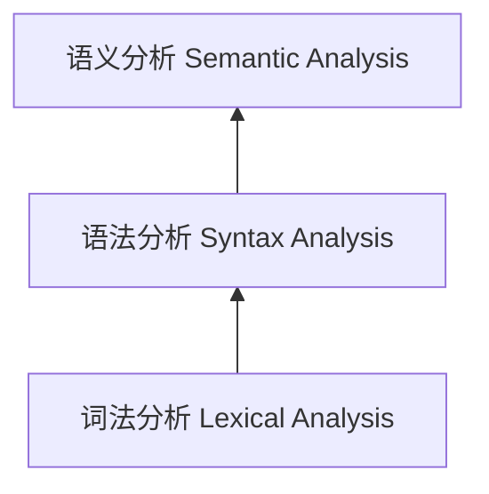
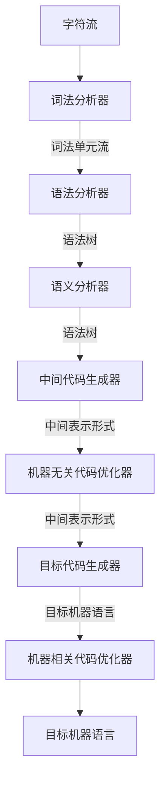

# 编译原理（哈工大）笔记

讲师[陈鄞（yin）](https://www.icourse163.org/u/6989061495?userId=7377598)。

## 1 [什么是编译](https://www.bilibili.com/video/BV1zW411t7YE?p=1)

计算机程序设计语言分为三个层次：

```
高级语言（High Level Language）
汇编语言（Assembly Language）
机器语言（Machine Language）
```

**机器语言**可被计算机直接理解，但与人类习惯相去甚远；**汇编语言**引入助记符（如：`MOV X, 2`）；**高级语言**类似于数学定义或自然语言的简洁形式。

编译是一种翻译的过程，它是将高级语言（源语言）翻译成汇编语言或机器语言（目标语言）的过程。


编译器在语言处理系统中的位置

```
源程序
[预处理器（Preprocessor）]
经过预处理的源程序
[编译器]
汇编语言程序
[汇编器（Assembler）]
可重定位的机器代码
[链接器（Linker）/加载器（Loader）]
目标机器代码
```


**预处理器**负责把存储在不同文件中的源程序聚合在一起；并且把被称作**宏**的缩写语句转换为原始语句。

**可重定位**（Relocatable）是指在内存中存放的起始位置 L 不是固定的。

> 起始位置 + 相对地址 = 绝对地址

**加载器**可以修改可重定位地址；将修改后的指令和数据放到内存中适当的位置。

**链接器**可以将多个可重定位的机器代码文件（包括库文件）链接到一起；还可以解决外部内存地址问题。

## 2 [编译系统的结构](https://www.bilibili.com/video/BV1zW411t7YE?p=2)

人工英汉翻译的例子：

```
In the room, he broke a window with a hammer.
```



通过词法分析确定句子中各个单词的词性，通过语法识别句子中的各类短语，从而获得句子的结构，接下来进行语义分析，确定各个名词成分与核心谓语动词的语义关系，最后给出**中间表示形式**。

编译器的结构：



其中，**分析部分**（前端）与源语言相关，包括词法分析器、语法分析器、语义分析器和中间代码生成器。

**综合部分**（后端）与目标语言相关，包括目标代码生成器和机器相关代码优化器。

什么是语法制导翻译（Syntax Directed Translation）？

在语法分析，分析句子结构的同时，结合语义规则，直接进行语义分析，这一技术称为语法制导翻译。

## 3 [词法分析概述](https://www.bilibili.com/video/BV1zW411t7YE?p=3)

词法分析是编译的第一个阶段。它的主要任务是从左向右逐行扫描源程序的字符，识别出各个单词，确定单词的类型，将识别出的单词转换成统一的**机内表示** --- 词法单元（token）形式。

```
token: < 种别码, 属性值 >
```

程序语言的单词类型，可以分为如下5类：

|  | 单词类型 | 种别 | 种别码 |
| --- | --- | --- | --- |
| 1 | 关键字 | program, if, else, then, ... |   一词一码 |
| 2 | 标识符 | 变量名，数组名，记录名，...|         多词一码 |
| 3 | 常量   | 整型、浮点型、字符型... |           一型一码 |
| 4 | 运算符 | 算术（+ - * / ++ --）<br> 关系（> < == != >= <=）<br>逻辑（& \| !）| 一词一码 |
| 5 | 界限符 | ; ( ) = { } |                    一词一码 |

例：词法分析后得到的 token 序列

输入：`while(value!=100){num++;}`

输出：

```
1 while     < WHILE ,   -   >
2 (         <  SLP  ,   -   >
3 value     <  IDN  , value >
4 !=        <   NE  ,   -   >
5 100       < CONST ,   -   >
6 )         <  SRP  ,   -   >
7 {         <   LP  ,   -   >
8 num       <  IDN  ,  num  >
9 ++        <  INC  ,   -   >
10 ;        <  SEMI ,   -   >
11 }        <   RP  ,   -   >
```

种别码应该用整型表示，这里使用了宏定义的形式，更直观。

## 4 [语法分析概述](https://www.bilibili.com/video/BV1zW411t7YE?p=4)

**语法分析器**（parser）从词法分析器输出的 token 序列中识别出各类短语，并构造**语法分析树**（parse tree）。

例1：赋值语句的分析树

```c
position = initial + rate * 60;
```

token 序列：

```
position    < id, position >
=           < = >
initial     < id, initial >
+           < + >
rate        < id, rate >
*           < * >
60          < num, 60 >
;           < ; >
```

> 本节视频 01:06 处，有赋值语句分析树的图形。

例2:变量声明语句的分析树

文法：

```
<D> -> <T> <IDS>;
<T> -> int | real | char | bool
<IDS> -> id | <IDS>, id
```

其中：

1. `D` 表示声明语句 Declaration
1. `T` 表示类型 Type
1. `IDS` 表示标识符序列 Identifier Sequence
1. `|` 表示「或」关系

如果输入 `int a, b, c;` 则它的分析树在本节视频 02:57 处。

如何根据语法规则为输入句子构造语法树？

## 5 [语义分析概述](https://www.bilibili.com/video/BV1zW411t7YE?p=5)

语义分析的主要任务：

1. 收集标识符的属性信息
    - 种属（Kind）：简单变量、复合变量（数组、记录、...）、过程、...
    - 类型（Type）：整型、实型、字符型、布尔型、指针型、...
    - 存储位置和长度
    - 值
    - 作用域
    - 参数和返回值信息：参数个数、参数类型、参数传递方式、返回值类型、......
1. 语义检查
    - 变量或过程未经声明就使用
    - 变量或过程名重复声明
    - 运算分量类型不匹配
    - 操作符与操作数之间的类型不匹配：比如数组下标不是整数；对非数组变量使用数组访问操作符；对非过程名使用过程调用操作符；过程调用的参数类型或数目不匹配；函数返回类型有误；

在 02:12 处，视频讲解了存储位置和长度对于变量相对位置的影响。

```
begin
    real x[8];
    integer i, j;
    ......
end
```

收集的标识符的属性信息，都会存储到**符号表**（Symbol Table）中。见视频 03:03 处。

符号表通常带有一个**字符串表**，用来存放程序中用到的标识符和字符常数。

> 字符串表存在的意义是什么？为了尽可能重复使用标识符吗？降低信息容量？

## 6 [中间代码生成及编译器后端概述](https://www.bilibili.com/video/BV1zW411t7YE?p=6)

常用的中间表示形式

1. 三地址码（Three-address Code）
1. 语法结构树/语法树（Syntax Trees）

三地址码由类似汇编语言的指令序列组成，每个指令最多有三个操作数（operand）。

常用的三地址指令

| 序号 | 指令类型 | 指令形式 |
| --- | --- | --- |
| 1 | 赋值指令 | x = y `op` z<br>x = `op` y |
| 2 | 复制指令 | x = y |
| 3 | 条件跳转 | if x `relop` y goto n |
| 4 | 无条件跳转 | `goto` n |
| 5 | 参数传递 | `param` x |
| 6 | 过程调用 | `call` p, n |
| 7 | 过程返回 | `return` x |
| 8 | 数组引用 | x = y`[i]` |
| 9 | 数组赋值 | x`[i]` = y |
| 10 | 地址及<br>指针操作 | x `=&` y<br>x `=*` y<br>`*`x `=` y  |

> `if x relop y goto n` 意思是，如果 x 和 y 满足关系操作 relop，则跳转到地址 n

> `param x` 将 x 设置为参数

将三地址指令表示成数据结构，有以下几种格式：

1. 四元式（Quadruples）。`(op, y, z, x)`
1. 三元式（Triples）
1. 间接三元式（Indirect triples）

> 视频 04:35 处有三地址指令的四元式表示汇总列表

三地址指令序列唯一确定了运算完成的顺序。

中间代码生成的例子

> 视频 07:52 有以下代码的语法树及四元式

```
while a < b do
    if c < 5 then
        while x > y do
            z = x + 1
    else x = y
```

### 目标代码生成

- 目标代码生成以源程序的中间表示形式作为输入，并把它映射到目标语言
- 目标代码生成的一个重要任务是为程序中使用的变量**合理分配寄存器**

### 代码优化

为改进代码所进行的等价程序变换，使其运行得更快一些、占用空间更少一些，或者两者兼顾。

代码优化分为机器无关优化（在中间代码层面进行优化）和机器相关优化（目标代码层面进行优化）。

## 7 [语言及其文法的基本概念](https://www.bilibili.com/video/BV1zW411t7YE?p=7)

> 这属于第二章「语言及其文法」的第一节。

TODO

## 参考资料

1. [编译原理（哈工大）](https://www.bilibili.com/video/BV1zW411t7YE?p=1)，讲师陈鄞，哔哩哔哩