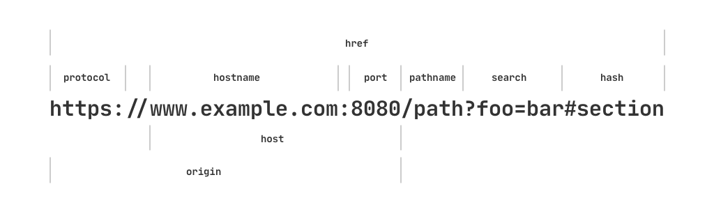

# 关于 URL

`URL` 接口提供了处理 url 的方法和属性。比如：

```js
new URL('https://www.example.com:8080/path?foo=bar#section')

// 输出如下：
URL {
  href: 'https://www.example.com:8080/path?foo=bar#section',
  origin: 'https://www.example.com:8080',
  protocol: 'https:',
  username: '',
  password: '',
  host: 'www.example.com:8080',
  hostname: 'www.example.com',
  port: '8080',
  pathname: '/path',
  search: '?foo=bar',
  searchParams: URLSearchParams { 'foo' => 'bar' },
  hash: '#section' }
```

各部分图示如下：



## 参考文献

1. [URL | MDN][1]

[1]: https://developer.mozilla.org/en-US/docs/Web/API/URL "URL | MDN"