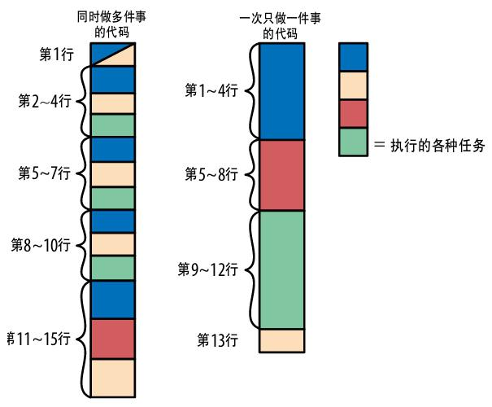

# 代码整洁之道

整洁代码之道和提升代码可读性是一回事。这个抽象的概念，需要有趣的例子，或者真实的代码，方便直观感受。

## 推荐书籍


<sub>[代码整洁之道](https://book.douban.com/subject/4199741/)，作者 *Robert C. Martin*（Bob 大叔），人民邮电出版社，2010/01</sub>

## 唯一标准

在《Clean Code》一书中 Bob 大叔认为，「别人在阅读代码过程中飙脏话的频率是衡量代码质量的唯一标准」。


<sub>漫画作者：*Thom Holwerda*，原始链接：https://www.osnews.com/story/19266/wtfsm/</sub>

Tony Hoare 托尼·霍尔

> There are two ways of constructing a software design: One way is to make it so simple that there are obviously no deficiencies, and the other way is to make it so complicated that there are no obvious deficiencies. The first method is far more difficult.

编写软件有两种方式：一种让它足够简单，明显没有缺陷；另一种让它很复杂，看不出明显的缺陷。第一种方法要难得多。

代码的可读性其实不是针对的编译器、解释器，而是对于人来说的。具有良好可读性的代码，应该是能让人快速理解、轻松维护、容易扩展的。

当然，可读性的标准具有强烈的主观性。没有对错，只看个人选择。

可以从三个方面提升可读性：

1. 表面层次的改进
2. 简化逻辑
3. 重新组织代码

## 表面层次的改进

### 使用合适的名字

这是 ITworld 发起的一个投票，其中不分年龄不分经验接近半数的人认为命名是最头疼的事情。


当我们在代码中给方法、变量等命名的时候，应该遵循「将信息装入名字 」这一原则。

要将信息装入名字就需要我们在命名时选择专业的词，避免空洞、泛泛的词。比如，单字母、tmp、buf 等无意义的词。

当然在循环中惯用的 i, j 等表示索引，可以使用。

### 写清晰的注释

注释应该是说明代码的意图，而不是简单的复述代码的行为。当我们在写注释时，应当是从更高的思维层次上来说明编写这段代码时的想法，就像是一个作家在阐述自己写作时的想法一样。

比如：

```js
// 对于这些数据，二叉树要比哈希表快得多。
```

千万不要只是写一大段谁都能从代码里看出来的废话。

### 更好的代码风格

代码宽度

目前主流的代码规范都推荐代码宽度保持在 80 为宜，这么做当然是有历史原因，但在现在也还是有其实用价值的。因为将代码宽度限制在 80，是在需要打印代码的时候，完美适配 A4 纸的宽度。即使只是将代码贴在个人博客或在线网站上，这也是最适合代码阅读的宽度。当使用大屏显示器编程时，这个宽度也是很适合分屏工作的。

代码顺序

在组织方法的时候，应该遵循一定的逻辑顺序。但具体要遵照什么逻辑顺序，是可以按照自己的想法的，比如，从「重要」到「不重要」、按字母顺序排序等等。但最重要的是要一直坚持已有的风格，不一致的风格比没有风格更让人混乱。

## 简化逻辑

每当你看到一个复杂的逻辑、一个巨大的表达式、一大堆变量时，你就应该思考应该怎么优化它们。因为这些都会增加你头脑的压力，要知道每个人的短期记忆都是很有限的。当你不得不思考过多的事情时，很可能在不知不觉中就产生 bug。

这里介绍几个简化逻辑的方法：

### 拆分复杂表达式

要拆分复杂表达式，可以使用「解释变量」的方法。比如：

```js
if (line.split(':')[0].trim() === 'root') {
    // Do something
}
```

这里我们可以加入一个额外的解释变量：

```js
const username = line.split(':')[0].trim();
if (username === 'root') {
    // Do something
}
```

### 德摩根定律

德摩根定理就是对于一个布尔表达式，有两种等价写法：

* (not a) and (not b) = not (a or b)
* (not a) or (not b) = not (a and b)

### 尽可能简化变量

对于变量的使用，主要有三个需要注意的地方：

1. 变量越多，越难全部追踪它们的动向。
1. 变量作用域越大，就需要跟踪它们的动向越久。
1. 变量改变得越频繁，就越难跟踪其当前值。

## 重新组织代码

重新组织代码俗称「重构」。重构指在不改变软件系统外部行为的前提下，改善它的内部结构。

这里简单说说三种组织代码的方法：

### 抽取不相关的子问题

也就是要积极发现并抽取出不相关的子逻辑，在看某个代码块时，问问自己这段代码能不能抽取到独立的函数中。要知道「所谓工程学就是把大问题拆分成小问题再把这些问题的解决方案放回一起」，在编程过程中我们也应当经常拆分大问题，这能让你的代码更健壮和易读。

### 一次只做一件事

同时在做几件事的代码会让人很难理解，一个代码块可能会做初始化对象、解析输入、在界面展示。过多的不同业务代码纠缠在一起，会让你很难清楚理解它的逻辑。因此，我们应当将代码组织的尽可能清晰，我们不仅可以将一个大函数拆分为多个小一些的函数来区分边界，也可以在函数内部组织代码，使得其感觉上像是有分开的逻辑段，就像下面这张图片展示的一样。



[Vue 3.0 Composition API RFC][7] 中，也有一幅类似的对比图：


### 把想法变成代码

其实检验代码可读性最简单的方法就是看看自己能不能很简单的将代码解释给别人。当人在解释一件复杂的事情时，最容易发现自己没有完全理解的小细节。能够用「自然语言」解释想法是很有价值的一个能力，这需要把一个想法归纳成精炼的概念，这不仅能帮助他人理解，也有助于自己把这个想法想得更清晰。

## 参考资料

1. [代码可读性提升指南 - 简书][1]，作者Hevin，2016/09/05
1. [写还是不写注释？ - 知乎][2]，作者Hevin，2017/07/19
1. [google/styleguide][3]
1. [Google JavaScript Style Guide][4]
1. [为什么有些国家的机动车是靠左行驶的？ - 百度知道][5]
1. [Airbnb JavaScript Style Guide][6]
1. [Composition API RFC | Vue Composition API][7]
1. [Vue.js Style Guide][8]

[1]: https://www.jianshu.com/p/39517a8c66bc "代码可读性提升指南"
[2]: https://zhuanlan.zhihu.com/p/27974988 "写还是不写注释？"
[3]: https://github.com/google/styleguide "google/styleguide"
[4]: https://google.github.io/styleguide/jsguide.html "Google JavaScript Style Guide"
[5]: https://zhidao.baidu.com/question/567559112.html "为什么有些国家的机动车是靠左行驶的？"
[6]: https://github.com/airbnb/javascript "Airbnb JavaScript Style Guide"
[7]: https://vue-composition-api-rfc.netlify.app/#code-organization "Composition API RFC | Vue Composition API"
[8]: https://vuejs.org/v2/style-guide/ "Style Guide - Vue.js"