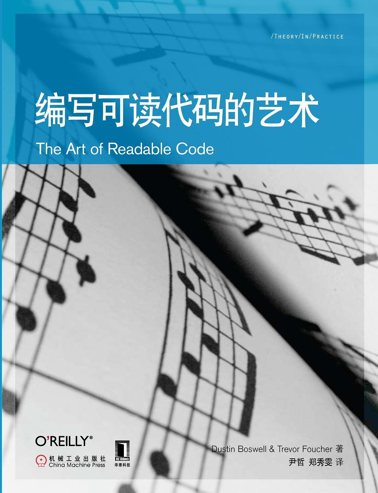

# 代码整洁之道

## 推荐书籍

[代码整洁之道](https://book.douban.com/subject/4199741/)，作者 *Robert C. Martin*（Bob 大叔），人民邮电出版社，2010/01

[编写可读代码的艺术](https://book.douban.com/subject/10797189/)，作者 *Dustin Boswell* & *Trevor Foucher*，机械工业出版社，2012/07

## 标准

在《Clean Code》一书中 Bob 大叔认为在代码阅读过程中人们说脏话的频率（`WTFs/m`）是衡量代码质量的唯一标准。

漫画作者：*Thom Holwerda*，原始链接：https://www.osnews.com/story/19266/wtfsm/

代码应当易于理解，最小化代码理解时间。

Tony Hoare 托尼·霍尔

软件设计有两种方式：一种方式是，使软件过于简单，明显没有缺陷；另一种方式是，使软件过于复杂，没有明显的缺陷。

## 使用合适的变量名

> You should name a variable using the same care with which you name a first-born child.

其他人关心程序的运行结果，程序员要关心程序的内部结构。