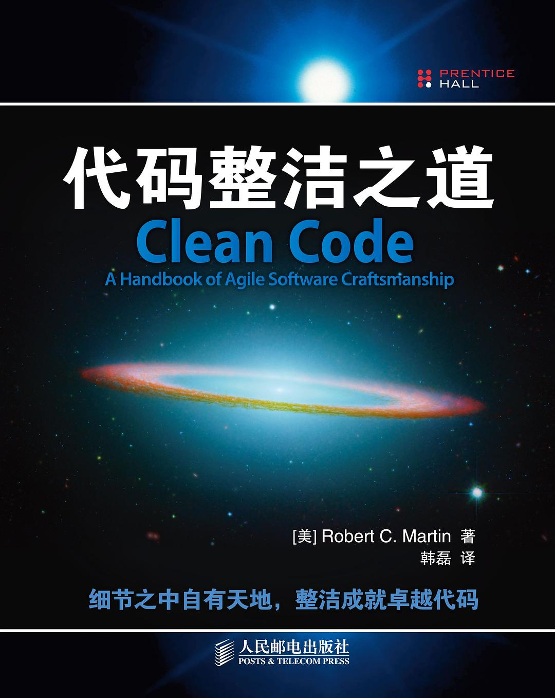
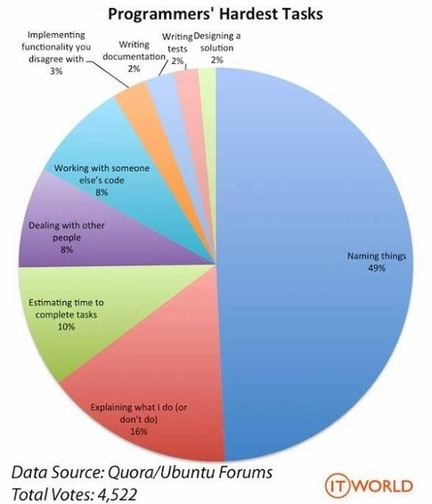

# 代码整洁之道

讲授代码整洁之道时，关键是真实代码的例子，这样才能直观看到差异。

## 推荐书籍

[代码整洁之道](https://book.douban.com/subject/4199741/)，作者 *Robert C. Martin*（Bob 大叔），人民邮电出版社，2010/01

## 标准

在《Clean Code》一书中 Bob 大叔认为在代码阅读过程中人们说脏话的频率（`WTFs/m`）是衡量代码质量的唯一标准。

漫画作者：*Thom Holwerda*，原始链接：https://www.osnews.com/story/19266/wtfsm/

Tony Hoare 托尼·霍尔

> There are two ways of constructing a software design: One way is to make it so simple that there are obviously no deficiencies, and the other way is to make it so complicated that there are no obvious deficiencies. The first method is far more difficult.

编写软件有两种方式：一种让它足够简单，明显没有缺陷；另一种让它很复杂，看不出明显的缺陷。第一种方法要难得多。

## 使用合适的变量名

这是 ITworld 发起的一个投票，其中不分年龄不分经验接近半数的人认为命名是最头疼的事情。

